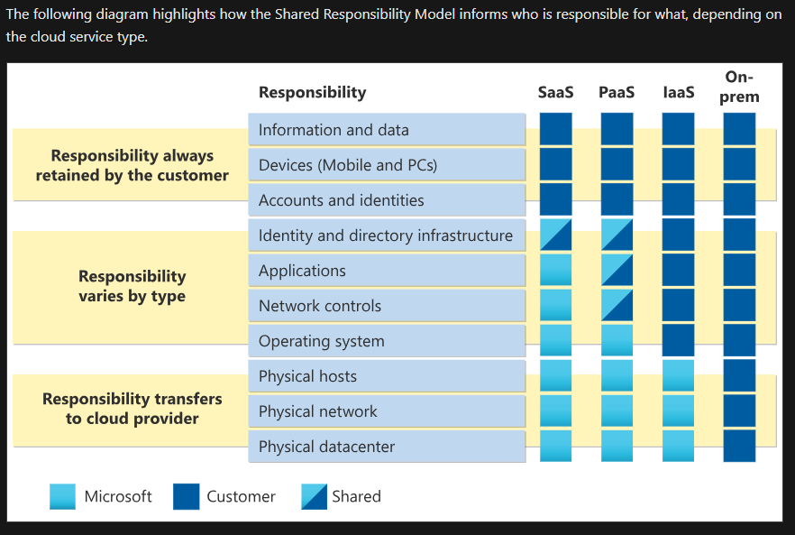

# Learning objectives

After completing this module, you’ll be able to:

- Define cloud computing.
    - Resource Allocation
    - Pay as you Go
    - Easy Scalability

- Describe the shared responsibility model.
    - 

- Define cloud models, including public, private, and hybrid.
    - 

- Identify appropriate use cases for each cloud model
    - 

- Describe the consumption-based model.
    - 

- Compare cloud pricing models.
    - 

    