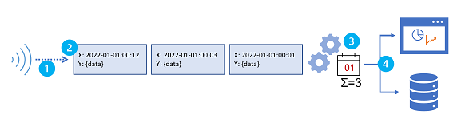

# Azure Streaming Analytics

Course Details:
- [Implement a Data Streaming Solution with Azure Stream Analytics](https://learn.microsoft.com/en-us/training/paths/implement-data-streaming-with-asa/)

## Get started with Azure Stream Analytics
- Cloud-based stream processing engine that you can use to filter, aggregate, and otherwise process a real-time stream of data from various sources
- PaaS service

- What is a Data Stream?
    - Series of data, typically related to specific point-in-time events
    - Need of Stream analytics
        - Continuously analyzing data to report issues or trends.
        - Understanding component or system behavior to help plan future enhancements.
        - Triggering specific actions/alerts when certain events occur or thresholds are exceeded.
    - Characteristics
        - Unbounded data stream
        - Each data object is timestamped
        - Data aggregation is performed over `Temporal windows`
        - 

- Stream Analytics is for complex event processing/analysis of streaming data
    - Analytics is used to:
        - `Ingest data` from an input: *Azure IoT Hub*, or *Azure Storage blob container*.
        - `Process data` using a query
        - `Write outputs` to *Azure Data Lake Gen 2*, *Azure SQL Database*, *Azure Synapse Analytics* etc
    - Guarantees `once event processing` and `at-least once event delivery`
    - Provides checkpoints to maintain/check etl jobs

- ASA Jobs & Clusters
    - Jobs will process the data
    - Inputs
        - Azure Event Hubs
        - Azure IoT Hub
        - Azure Blob storage
        - Azure Data Lake Storage Gen2
        - *Can `reference inputs` used to ingest static data to augment the real-time event stream data.*
    - Outputs
        - Supports a wide range of outputs
            - loads them into a data lake or data warehouse
            - Append data to a dataset in Power BI
            - Writes the results of stream processing to an event hub.
    - Queries
        - EventProcessedUtcTime
        - When using an *Event Hubs input*, a field named EventQueuedUtcTime to record time of event queued in Hub

- Windows Function