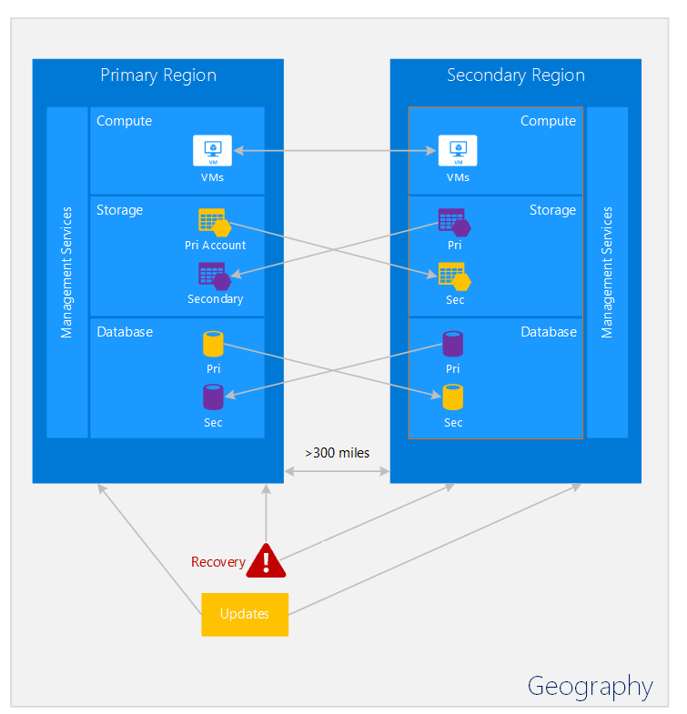
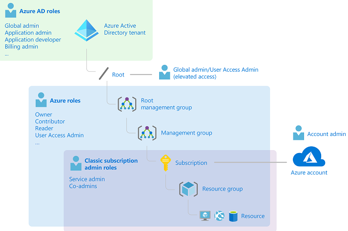

# Azure Securing your Data

## Top 5 security items to consider before pushing to production

- Use Microsoft Defender for Cloud.
    - Can monitor both Cloud and On-premises services

- Verify your application's inputs and outputs.
    - Inputs:
        - Security weakness of current applications is a failure to correctly validate input data
        - Don't use inline SQL
        - Use Procedures instead o`f inline SQL
    - Outputs:
        - Screen outputs are encoded, not to be interpreted as code

- Store your secrets into Key Vault.
    - Service - `Azure Key Vault`
        - centralized cloud service for storing application secrets
        - Secrets are stored in individual vaults, own configuration and security policies to control access.
        - Can get data through a REST API or client SDK's
    - Why use Key Vault
        - Credential theft
        - Manual key rotation
        - Certificate renewal.

- Ensure you're using the latest version of your framework, and its security features.
    - Use new modern frameworks
    - Built in security in .NET
        - Authentication - Identity Management
        - Authorization
        - Data Protection
        - Secure Configuration
        - Security Extensibility APIs

- Validate that your program dependencies and libraries are safe to use.
    - OWASP top 10 list of worst web application vulnerabilities
    - Track known security vulnerabilities 
        - `Mitre` maintain *Common Vulnerabilities and Exposures list*
            - If you find a library or component in the CVE database, it has known vulnerabilities
    - Vulnerabilities in your third-party compo
        - Run these tools against your codebase, or better yet, add them to your CI/CD pipeline
            - OWASP Dependency Check, which has a Jenkins plugin
            - Snyk, which is free for open-source repositories in GitHub
            - Black Duck which is used by many enterprises
            - Retire.js

## Configure security policies to manage data

- Learn how to classify your data.
    - rest
        - Apply disk encryption to help safeguard your data.
        - Use encryption to help mitigate risks related to unauthorized data access.
    - in-process
    - transit
        - Secure access from multiple workstations located on-premises to an Azure virtual network - Use site-to-site VPN.
        - Secure access from an individual workstation located on-premises to an Azure virtual network - Use point-to-site VPN.
        - Move large data sets over a dedicated high-speed wide-area network (WAN) link - Use Azure ExpressRoute
        - Interact with Azure Storage through the Azure portal.

- Configure your data retention requirements.
- Explore data ownership and sovereignty.

- SQL Information Protection (SQL IP)
    - Azure SQL Auditing
    - Data Discovery & Classification
    - Dynamic data masking etc

- Classify your SQL DB
- Paired Regions
    - Cross-region activities number key
    - EG:  

## Secure your Azure Storage account

- Investigate the ways Azure Storage protects your data.
    - Protect the data at rest
    - Protect the data in transit
    - Support browser cross-domain access
    - Control who can access data
    - Audit storage access - (Storage Analytics service).

- Explore the authentication options to access data.
    - Understand storage account keys
        - Storage account keys
        - Protect shared keys

    - Understand shared access signatures
        - Types of shared access signatures
            - service-level SAS to allow access to specific resources in a storage account.
            - account-level SAS to allow access to anything that a service-level SAS can allow
        - Accounts that store user data have two typical design
            - front-end proxy service, which performs authentication.
            - A lightweight service authenticates the client, as needed

- Learn about Advanced Threat Protection.
    - Enable Microsoft Defender for Storage
    - Explore security anomalies
        - Nature of the anomaly
        - Storage account name
        - Event time
        - Storage type
        - Potential causes
        - Investigation steps
        - Remediation steps

- Learn how to control network access to data.
    - Manage default network access rules

- Explore the Azure Data Lake enterprise-class security features.
    - role-based access control (RBAC)
    - access control lists (ACLs) 
    - Authenticates through Microsoft Entra ID OAuth 2.0 bearer tokens

## Configure and manage secrets in Azure Key Vault

- Explore proper usage of Azure Key Vault
    - Vaults
        - Secure containers
    - Keys
        - central actor in the Azure Key Vault service
        - two variations on keys
            - hardware-protected
            - software-protected
    - Secrets
        - Secrets are small (less than 10K) data blobs protected by a HSM-generated key
    - Key vault uses
        - Secrets management
        - Key management
        - Certificate management

- Manage access to an Azure Key Vault
    - Key Vault access has two facets
        - management plane (creation of the Key Vault) - role-based access control (RBAC)
        - data plane (storing and retrieving a secret stored)
    - Authentication to identify the caller (Microsoft Entra tenant of the subscription that the Key Vault )
    - Authorization to determine the operations the caller 
        - Creating a new Azure Key Vault - role-based access control (RBAC): Key Vault Contributor
        - Contributor role that includes full administration rights
        - Reading and writing data in the Key Vault uses a separate Key Vault access policy.

- Explore certificate management with Azure Key Vault
    - Add certificates to a Key Vault
        - Can create self-signed certificates directly in the Azure portal
        - Can create an X.509 certificate signing request (CSR)
    - Retrieve certificates from a Key Vault

- Configure a Hardware Security Module Key-generation solution

## Secure your Azure resources with Azure role-based access control (Azure RBAC)

- Verify access to resources for yourself and others.
- Grant access to resources.
- View activity logs of Azure RBAC changes.
- 

## Secure your Azure SQL Database
