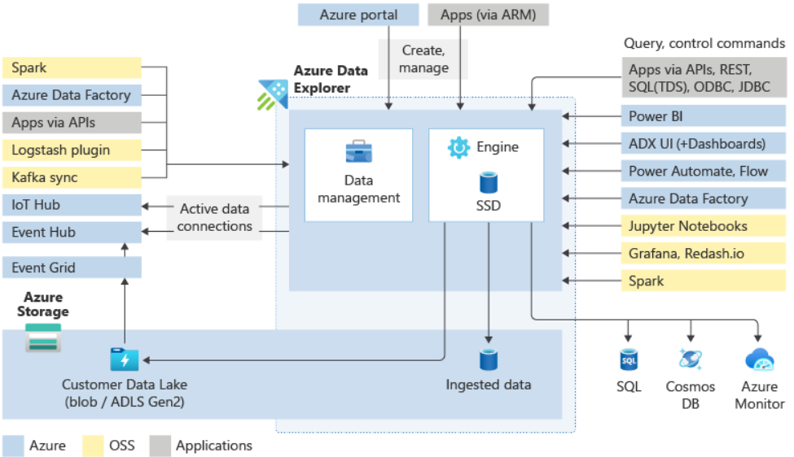
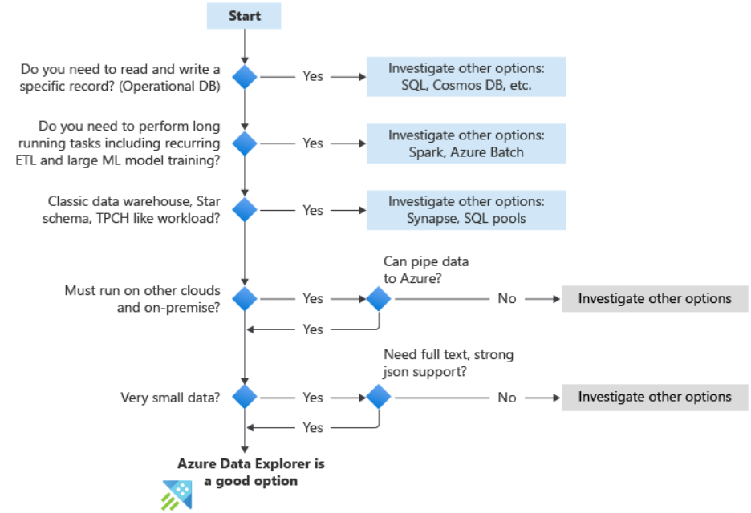
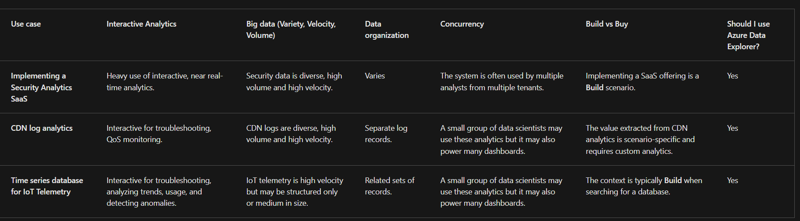

# Azure Data Explorer

## Introduction to Azure Data Explorer 
- Fully managed, high-performance, `Big data analytics` platform
- Use Azure Data Explorer to ingest various data types into a single collection comprised of:
    - structured data, such as internal operations systems.
    - semi-structured data, such as marketing clickstream data.
    - unstructured data, such as social media feeds.

- What will we be doing?
    - What are the strengths of Azure Data Explorer and the Kusto Query Language?
    - How do you work with the service?
    - What types of data can you analyze and where can the data come from?
    - How can you organize, display, or make the results of your queries actionable?

- Azure Data Explorer's key features (`Three`)
    - Can ingest terabytes of data in minutes in batch/streaming mode of any data type from any pipeline
    1. Data velocity
    2. Variety
    3. Volume

- KQL is language
- Advanced analytics
    - Large set of functions for time series analysis
    - Pattern detection is made easy with Cluster plugins
    - Embedding python code in KQL queries

- `How Azure Data Explorer works`
    - A Common workflow:
        - Data ingestion
        - Kusto Query Language
        - Data visualization
    
    - What's in an Azure Data Explorer cluster?
        - Can hold up to 10,000 databases
        -  each database up to 10,000 tables
        - data in each table is stored in data shards also called extents
        - Data is automatically indexed and partitioned based on the ingestion time
        - No primary foreign key constraints or any other constraints, such as uniqueness
        - Logical structure of a database is similar to many other relational databases
           - Tables: Made up of a set of columns. Each column has one of nine different data types.
           - External tables: Tables whose underlying storage is in other locations such as Azure Data Lake.

    - The general workflow
        - First you ingest your data to get it in the system. 
            - Web UI wizard
            - Managed pipelines, Azure Data Factory etc
            - Use connectors and plugins - eg: Kafka connector, Power Automate, Apache Spark connector

        - Ingested in two modes
            - Batching
            - Streaming
        
        - Then, you analyze your data.
            - Kusto Query Language (KQL) to analyze data.
                - Supports querying structured, semi-structured, and unstructured (text search) data
                - Wide variety of query language operators and functions
                - Supports cross-cluster and cross-database queries

        - Next, you visualize the results of your analysis.
            - Supports a display of up to 500-K records and thousands of columns
            - Display your results using native connectors
            
        - At any time, you may also engage with the data management features.
            - Using *Control commands*, you can create new clusters or databases, establish data connections, perform auto scaling, and adjust cluster configurations
            - control and modify entities
                - Metadata objects, managing permissions, and security policies
                - Can modify materialized views (continually updated filtered views of other tables) 
                - Functions (stored functions and user-defined functions)
                - Update policy (functions that are triggered following ingestion)

    - Architecture
        - 

    
- When to use Azure Data Explorer
    - Interactive analytics - *Do I need to analyze data interactively?*
    - Data variety - *How varied is my data structure?*
    - Data velocity - *Is real-time data analysis a critical factor?*
    - Data volume - *How much data do I need to ingest?*
    - Data organization - *How consistently is my data organized?*
    - Query concurrency - *How many users need to query/ingest/process data at the same time?*
    - Build vs Buy - *How much do I want to customize my data platform?*
    - `Questions to ask`
        - 

- Use Cases
    - 