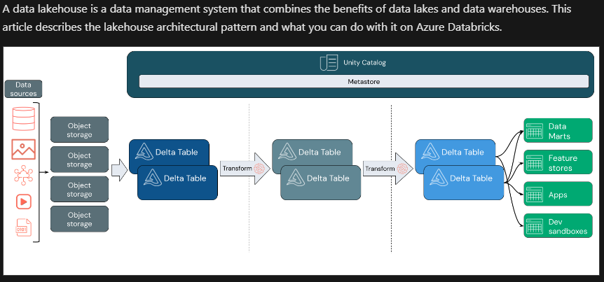

# Data Bricks

- For data processing and Analytics in a `Data Lakehouse`
- 
- Built on `Apache Spark`
- Managed service for Data Science, Engineering and Analytics
- Is like Jupyter Notebook
- Supports (Data Science and Engineering, Machine Learning), SQL(Premium Tier)

## Components of Data Bricks
- Apache Spark Clusters
    - Make use of clusters (multiple nodes)
    - Each cluster has a Driver node (coordinates processing jobs)
    - One/More worker nodes (for processing jobs)
    - Performs jobs in parallel
    - more at [Clusters](https://learn.microsoft.com/en-us/azure/databricks/compute/)

- Data lake storage
    - Each cluster has its own local file
    - Each Node in a cluster has access to shared file system for operations on data
    - This shared data storage is called as `Data lake Storage` - Azure Data Lake Storage, Microsoft OneLake data store

- MetaStore
    - A store to define a relational schema of tables(based on `Delta lake`, can perform SQL) over files-based data
    - Are managed in `Unity Catalog` (provides centralized data management)
        - Provides a suite of tool
            - These tools help provide access to
                - Ingest raw data into a lakehouse.
                - Create and read managed tables in secure cloud storage.
                - Register or create external tables containing tabular data.
                - Read and write unstructured data.

- Notebook
    - For data analysts, data scientists, data engineers

- SQL Warehouse
    - Relational compute resources with endpoints for web apps to connect to Azure databricks