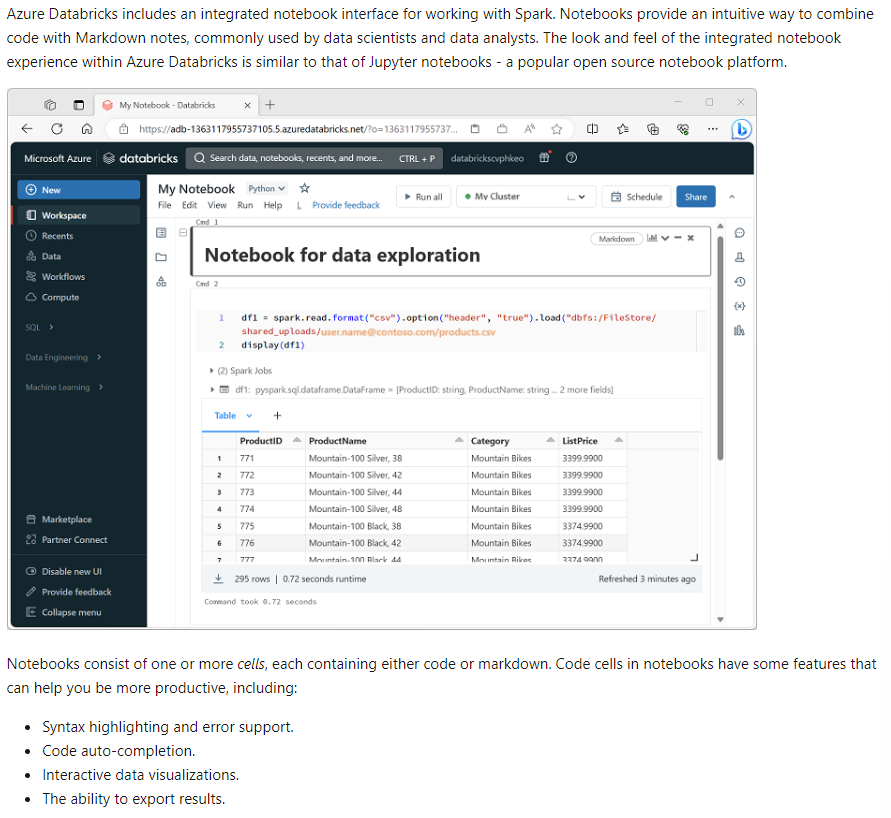

# Use Apache Spark in Azure Databricks

- Databricks Platform for analytics and processing using `Apache Spark`.
    - Flexible platform (supports langs/api)
    - Processing/Analytics by `Dataframe API`
    - We'll cover
        - Apache Spark architecture
        - Create and configure a Spark cluster
        - Use cases for Spark
        - Use Spark to process and analyze data stored in files.
        - Use Spark to visualize data.

    
## Apache Spark architecture

- Azure Databricks service launches/manages Spark clusters 
- Spark clusters are groups of computers treated as single
- Handle the execution of commands issued from notebooks
- `Clusters` enable processing data for parallelism
    1. Spark Driver -
        - Sends work to worker node
        - Contains the main loop
        - Creates distributed datasets on the cluster
        - Applies operations to those datasets
        -  Driver access Spark through `SparkSession`

    2. Worker Nodes

### Spark Jobs
- Work submitted to the cluster is split into as many independent jobs as needed
- Jobs are divided into tasks
- Inputs to a job are partitioned
- These partitions are unit of work for each slot
- In bw tasks, partitions may need to be reorganized 

- Secret to Spark's high performance is parallelism
    - `Scaling vertically` (by adding resources to a single computer) is limited to a finite amount of RAM, Threads and CPU speeds;
    - but clusters `scale horizontally`, adding new nodes to the cluster as needed.

- Spark parallelizes jobs at two levels:
    - `First level of parallelization` is the executor (a Java virtual machine (JVM) running on a worker node, typically, one instance per node.)
    - The `second level of parallelization` is the slot - the number of which is determined by the number of cores and CPUs of each node.
    - Each `executor has multiple slots` to which parallelized tasks can be assigned.
    - 

### Jobs and stages

- Each job is broken down into stages
- `Useful analogy is to imagine that the job is to build a house`:
    1. The first stage would be to lay the foundation.
    2. The second stage would be to erect the walls.
    3. The third stage would be to add the roof.

### Create a Spark cluster
- 

### Azure manages Cluster resources
- 

### Use Spark in notebooks
- Used in two kinds of workloads
    1. Batch or stream processing jobs to ingest, clean, and transform data - often running as part of an automated pipeline
    2. Interactive analytics sessions to explore, analyze, and visualize data.

### Running Spark code in notebooks
- 

### Exploring data with dataframes
- Spark uses a `data structure` called a `resilient distributed dataset (RDD)`
- The most commonly used data structure for working with structured data in Spark is the `dataframe`, provided as part of the `Spark SQL library` (similar to pandas in python)
- The `%pyspark` line at the beginning is called a `magic`, and tells Spark that the language used in this cell is PySpark.

#### Using the Spark SQL API to query data
- 

## Visualize data
- Using built-in notebook charts
- Using graphics packages in code
