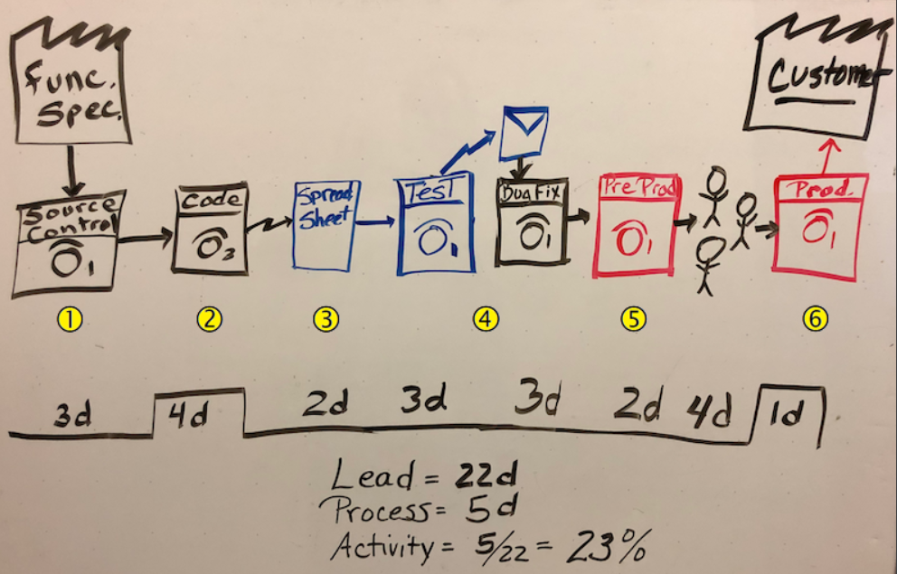

#  Get started with Azure DevOps

- `Part 1: Get Started with Azure Devops`
- Part 2: Build apps with Azure Devops
- Part 3: Deploy apps with Azure Devops

## Take Aways:

- See how `value stream maps` can help you evaluate your current processes and technologies
    - Value stream Map
        - VSM to improve your release process.
        - Compute the activity ratio, or overall efficiency
        - EG: 
- Sign up for your free Azure DevOps organization
- Learn how to plan and track work items using Azure Boards
- Optimize sprint workloads across multiple Agile teams?
