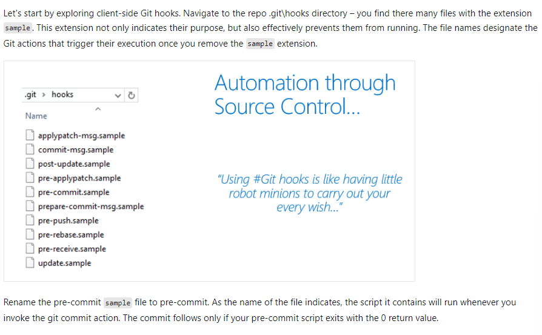

# AZ400 - Development for enterprise DevOps

## Introduction to DevOps

`"DevOps is the union of people, process, and products to enable continuous delivery of value to our end users."`

- DevOps Lifecycle
    - Plan
    - Build
    - Deploy
    - Operate
    - Best Practice
        - Shorten cycle time/smaller batches
        - More automation
        - Improve telemetry
        - Deploy frequently
    - Journey
        - 
        - 
        - 
        - 
    - Agile Practices
        - 

- Software Development 
    - `OODA` (Observe, Orient, Decide, Act)
    - 
    - 
    - 

## Design & Implement branch strategies/workflows

- Git Branching Workflows
    - Should be scalable with team size
    - easy to backtrack
    - Should not have overhead
    - `COMMON EXAMPLES`
        - Trunk-based development
            - All Development on main/master
            - small batches of commits
            - CI and automated testing
        - Feature branch Workflow
            - New branch for each feature
            - develop, test, change in isolation
            - Allows parallel development
        - Release branch workflow
            - Dedicated from main for releasing
            - stabilize the code, last minute changes
            - Once ready, merged into main
            - Allows control & organized release process
        - Forking workflow
            - No server side repo as central codebase
            - Each developer with a server-side repo
            - Each developer has (private local & public server-side repos)
            - Allows parallelism while being clean/organized

- Implement feature branches
    - Branch policies

- Implement Github Flow
    - A branch-based workflow
- Fork Worflow
    - Private local repo
    - public server side
    - Forked (server-side) vs Cloned (client-side)

## Explore Git hooks
- Understand Git hooks
- Identify when used Git hooks
- Implement Git hooks for automation
- Explain Git hooks' behavior

### Git Hooks Explained
- 
- `Practical use-cases`
    - In Enforcing preconditions for merging
    - Verifying work Item ID association in your commit msg
    - Preventing you/your team from committing faulty code
    - Sending notifications to your team's chat room (Teams, Slack, HipChat, etc.)
- `How to implement Git hooks`
    - Client-side Git hooks
        - 
        - 
    - Server-Side Hooks
        - While client-side Git hooks offer robust capabilities for enhancing the development workflow, Azure Repos also provides server-side hooks to further augment the development process, including support for creating pull requests.
        - more at https://learn.microsoft.com/en-us/azure/devops/service-hooks/events?view=azure-devops

## Plan foster inner source 

Inner source  = Internal Open Source within organizations using forking workflows

## Manage and configure repositories

- Understand large Git repositories
    - 2 causes of large repos
        1. long history
        2. large binary files
        - Resolve this using a `shallow clone` with a specific dept to have less history

- Explain VFS for Git
    - VFS for Git helps with large repositories. It requires a Git LFS client.
        - `Partial clone`- reduces time to get a working repository by not downloading all Git objects right away.
        - `Background prefetch`: downloads Git object data from all remotes every hour, reducing the time for foreground git fetch calls.
        - `Sparse-checkout`: limits the size of your working directory.
        - `File system monitor:` tracks the recently modified files and eliminates the need for Git to scan the entire work tree
        - `Multi-pack-index`: enables fast object lookups across many pack files.
        - `Incremental repack`: Repacks the packed Git data into fewer pack files without disrupting concurrent commands using the multi-pack-index.

- Use Git Large File Storage (LFS)
- Purge repository data
- Manage and Automate Release Notes with GitHub