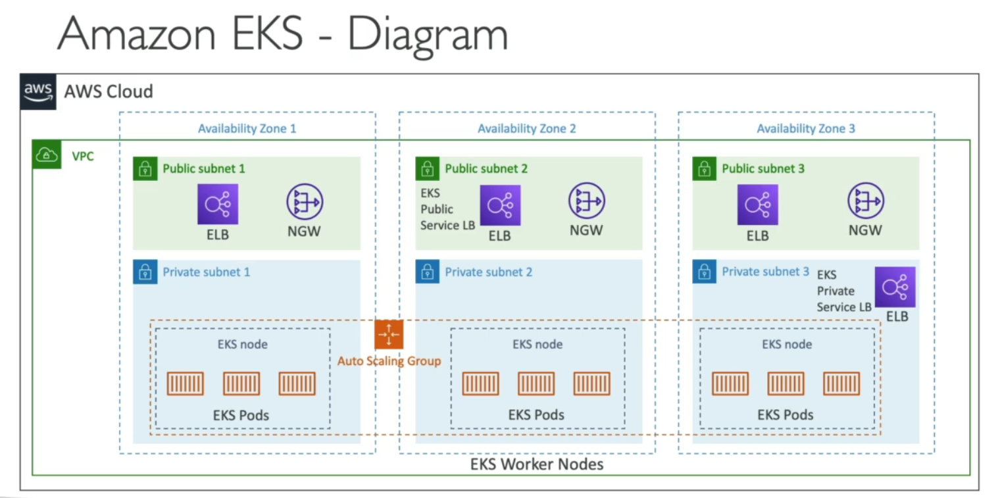

# Amazon Elastic Kubernetes Service (EKS)

## Theoretically 
- Managed K8s cluster on AWS
- Similar to ECS, ECS is not opensource
- Two launch modes
    - EC2 Mode
    - Fargate (serverless containers)
- To expose cluster to web, public/private load balancers are setup
- EKS NodeTypes
    - Managed Node Groups
        - Creates/manages EC2 instances
        - Nodes are part of AutoScalling Group
        - Supports on-Demand or Spot instances
    - Self-Managed Nodes
        - You create/register nodes to EKS cluster
        - Can use EKS AMI's or custom AMI
        - Supports on-Demand or Spot instances
    - AWS Fargate
        - No nodes are managed
        - Containers are run on top of EKS

- EKS Data Volumes
    - Must specify StorageClass manifest on EKS cluster
    - Leverages a container-storage-interface (CSI) complaint driver
    - Support for
        - Amazon EBS
        - Amazon EFS (works with Fargate)

- Diagram
    - EKS pods are similar to ECS tasks

## Hands-On-Practice
- Not available in free tier

- For `EC2 launch mode`:
    - To create a cluster, create a `Cluster service Role`
        - Create a role in IAM
            - Select service and then EKS as use case
            - Need to have a VPC, Subnets, and Security
            - Publicly accessible

- For `Fargate launch mode`:
    - Specify name and K8s version
    - Create a `Cluster service Role`

- Following this resource
    - [Run K8s app on AWS-EKS with Fargate: A Kotlin Spring Boot demo](https://medium.com/khalane/running-kubernetes-applications-on-aws-eks-with-fargate-a-kotlin-spring-boot-demo-39f3d3e64663)
    - Get the code from here: [Sample Code](https://github.com/tkhalane/randmeth-campaigns)
