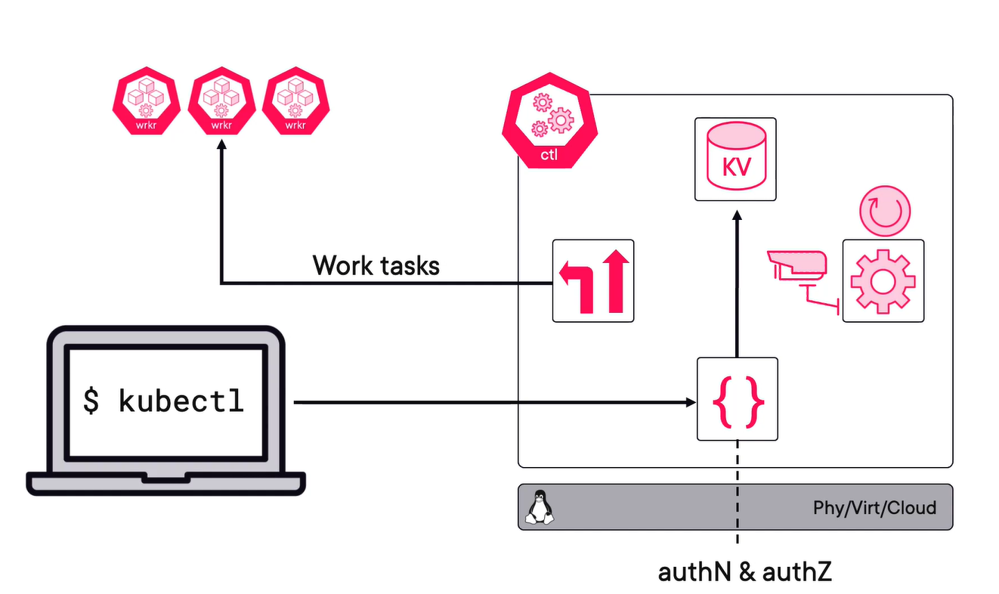
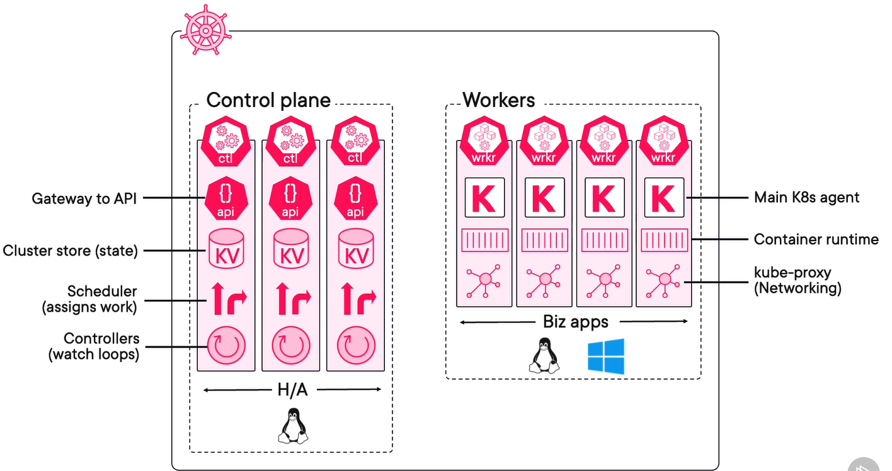
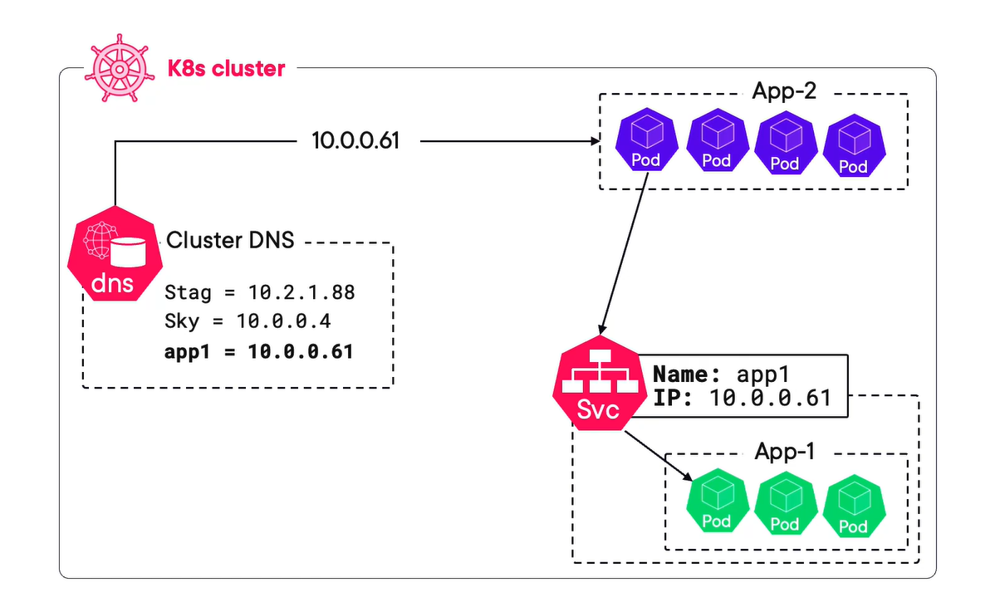
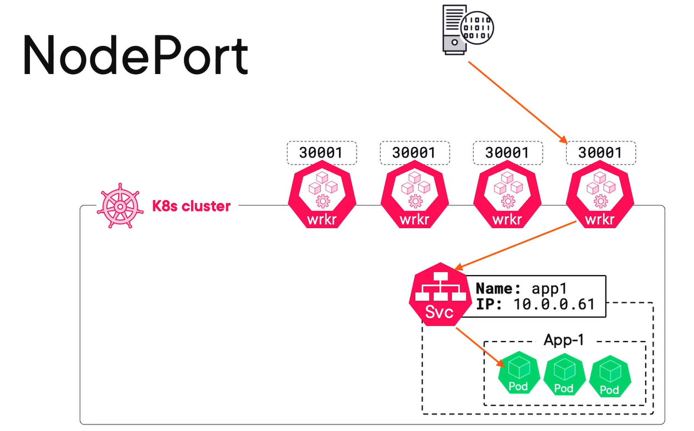
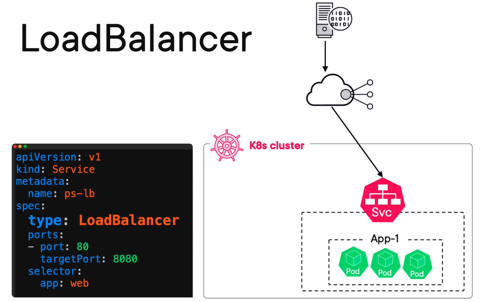

# Kubernetes

Learn Kubernetes in various on-prem and cloud environments such as:
- Local using Docker Desktop
- Cloud Platforms
    - Amazon (EKS)
    - Azure (AKS)
    - Google (GKE)

## Local - Docker Desktop 
### Course Link
- [Getting Started with K8s with Nigel Poulton](https://app.pluralsight.com/ilx/video-courses/clips/374fcae1-fa4f-4bdc-8c3a-ef32cca2ac6a)
- [Course files and code](https://github.com/nigelpoulton/getting-started-k8s)

### Take Aways
- What is Kubernetes?
- Kubernetes Architecture
- Declarative Model and Desired State
- Getting Kubernetes
- Working with Pods
- Working with Services
- Working with Deployments
- What Next

#### What is Kubernetes?
- History
    - Means Helmsman (Greek)
    - Google with CNCF Project
    - github.com/kubernetes/kubernetes
    - written in `GO`
    - OpenSource
    - Related with Borg (Proprietary) and Omega (Proprietary) systems

- What it does
    - Container Orchestration
    - Similar to the role of OS
    - Communicates with the hardware to allocate resources
    - Sort of an abstraction layer
        - Packs apps in container
        - Describe them in Manifest
        - Done
    - Jargons
        - Monoliths vs Microservices (Containers)
- Why need it
    - Container Orchestration
        - Orchestration is like all players on a feild have a specific role along with a `COACH`. Coach manages the in-game strategy, replace players incase of injury. Change of strategy as per the requirements. Coach is the K8s.
    - Granular AutoScalling
    - Self healing

#### Kubernetes Architecture
- Big Picture
    - App in a package using a container and container is in a pod and the pod is in a deployment and all this is described in the K8's YAML file.
    - Place in a K8 Cluster (Feed the YAML)
    - Control Plane is the brain
    - Worker runs the user apps/services

- Control Plane Nodes or Masters
    - Should always be available
    - Use odd no of H/A Control planes (3 is magic, 5 is sweet)
    - Should be in different data centers
    - `1 is better than 2`
        - Split brain/Dealock
        - In case of network breakdown, each side will go int read-only mode because it won't have the majority
    - Follows an active/passive model
        - One is leader/Others are followers
        - For own clusters, linux machines for Control planes
    - Control plane features
    - In Hosted K8s, Cloud Manages control planes
    - Control Plane node not for userapps

    - Kuber-apiserver
        - front-end to control plane
        - everything to the control plane comes through this
        - EXPOSES the API(REST)
        - Consumes the YAML   
    - Cluster Store
        - Persists cluster state/configs
        - Based on `etcd`
        - Performance bottlenecks occur here
        - Have recovery plans
    - Kube-controller-manager
        - Controller
            - Node Controller
            - Deployments controller
            - Endpoints controller
        - Watch loops
        - Reconciles state
    - Kube-scheduler
        - Watches API server for work
        - Assigns tasks to worker
            - Affinity/Anti-affinity
            - Constraints
            - Taints
            - Resources

    - Commands is via `kubectl`
    

- Worker Nodes
    - kubelet
        - Main K8s agent
        - Registers node with cluster
        - Work is in the form of Pods
            - Pods is one or more containers deployed
        - Watches API server for work
        - Executes Pods
        - Reports back to control plane
    - Container-runtime
        - Previously it was Docker
        - Pluggable CRI
        - Container-d (High usage)
        - gVisor
        - Katacontainers
    - kube-proxy
        - Node Networking
        - Pod IP addresses (One IP/POD)
        - For multi-container pods (all containers will share the same IP)
    - `A service is a way of hiding multiple pods behind a single IP like a load balancer`
    - Come cloud provide Nodeless Kubernetes - `Virtual Kubelet`

- Pods
    - Atmoic units of k8s
    - Containers run inside a pod
    - Shared execution env for an app to run
        - One IP address and Ports
        - Memory
        - Containers within a pod share resources
        - Scaling in K8s happen at Pod level (Scale-up by adding Pod and Scale-down by removing Pod )
        - Service Mesh
            -  A pod in which there is a mesh container that helps the main app container for enhanced services
        - Pod Deployment is atomic operation
        - All containers in a pod are scehduled with the same cluster node
    - Annotations, Labels, Policies, Resources and Co-scheduling

- Services
    - Stable abstraction point for multiple pods
    - Stable IP and DNS
    - Acts as a basic load balancing
    - Labels (Ties the services with the ones containing the labels)
    - send traffic to only healthy pods
    - Can do session Affinity - ?
    - Can send traffic outside of cluster
    - Can do TCP and UDP

- Deployments
    - Deployments are controllers that control pods
        - Stateless apps
        - Statefull apps
        - Daemon sets (One pod per node)
        - Time-based short-lived jobs
    - Watches API server for new deployments
    - Implements them and keeps a watch to maintain desire state
    - Deployment Types
        - ReplicaSet

- The API and API Server
    - All above objects are resource in K8s API
    - K8s API contains definition and feature set of each resource
    - API server exposes the resource API - HTTPS/REST(methods)

- Recap
    - 

#### Declarative Model and Desired State
- K8s prefers with Declarative model
    - Using manifest files
    - key-value pairs
    - Desired State vs Observed State

#### Getting a K8s Lab
- Install Docker Desktop
- Enable Kubernetes from settings
- Download the course files
    - Working with containers and docker
        - Package the app in a container using DockerFile
        - Build a container image from DockerFile and tag it
        - Push the image onto a container-registry (DockerHub)
       
    - Working with Pods
        - App Deployment Workflow
            - Start with app code
            - build it in a container image
            - Store it in a repo
            - Define in YAML and Deploy on cluster
                - Create a `.yml` file and build it using `kubectl apply -f ".yml"`
                - `f` means that we are deploying from a manifest
            - Some usefull commands are:
                - docker image ps
                - docker ls
                - kubectl get nodes
                - kubectl get pods --watch
                - kubectl get pods -o wide
                - kubectl describe pods *pod-name*
        - Creating a pod manifest (YAML)
        - Deploying a Pod
        - Multi-container Pod

    - Working with Services
        - Theory
            - How to connect to the app - *Service*
            - REST object in API
            - Services are described in YAML
            - They provide Stable IP and DNS
                - Assigned by k8s
                - Called as ClusterIP
                - For internal communication
            - On creation k8s automatically creates an endpoints object, a dynamic list of healthy pods that match the services labels selector
            - Service selects its pods using *Labels*
            - Also provide basic loadbalancing
            - ClusterIP (Default Service) - Internal cluster connectivity:
                
            - NodePort service - External Access via nodes
                
            - LoadBalancer service - External Access via Cloud loadbalancer
                

        - Create a service *Imperatively* K8s does not prefer.
            -  It is done via CLI

        - Create a service Declaratively
            - The port picture in `code svc-nodeport.yml`
            - The endpoints that are created at service creation `kubectl get ep`

        - Create an Internet Loadbalancer service
    
    - Working with Deployments
        - Kuberenetes Deployment theory
            - Resources in Apps of the the API in API server
            - Application in container which in turns is in pods which is in a deployment
            - In between a pod(Scheduling & Execution) and deployment(Rollouts & Rollbacks) is a ReplicaSet(Reliability & Scaling)
        - Create a Deployment YAML
            - YAML with desired state
            - Post it on API-server
            - Creates a ReplicaSet with YAML
            - When new version(image) YAML is posted on API, another ReplicaSet is created with new image and the previous one exists.
            - There are different probes for smooth rollouts/rollbacks 
        - Deploy a Deployment
        - Self healing and Scaling
        - Rollouts and Rollbacks
