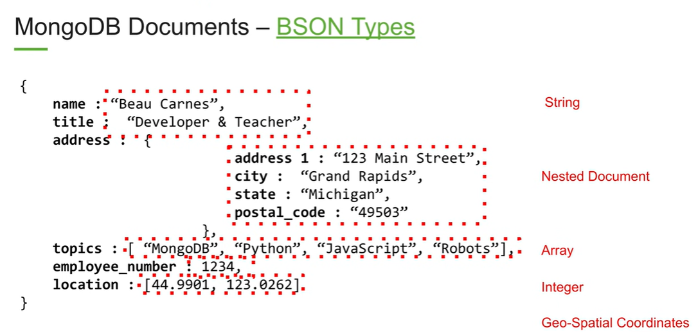

# MERN Stack

Learning resource for MERN Stack from the following course:
- [Learn the MERN Stack - FreeCodeCamp](https://www.youtube.com/watch?v=7CqJlxBYj-M)

## Agenda
- Introduction to MERN
- Database Concepts
- Getting started with MongoDB Atlas
- Creating the backend of excercise tracker app
- React introduction
- Creating the front-end of app
- Connecting the front-end to the backend

### Introduction to MERN
- MongoDB: Document-based open source database
- Express: Web application framework for Node.js, helps to create a server
- React: JavaScript library for front-end
- Nodejs: JavaScript run-time environment that executes JS code outside a browser(such as a server)
- Mongoose: Simple, schema-based solution to model application data
    - Helps to connect mongodb with nodejs easily

#### MongoDB
- MongoDB Documents - BSON Types (Binary JSON)
- Data that is accessed together is stored together
- ObjectID is handled by MongoDB
-    
- Setup a cloud based Mongo cluster via MongoDB atlas
    - Follow the youtube course
- Setup a local MongoDB cluster
    - [Setup a Local MongoDB Database](https://www.youtube.com/watch?v=D0U8vD8m1I0)

#### Backend
- Create a separate `backend` folder after `npx create-react-app mern-excercise-tracker`
- Install a tool `nodemon` - helps nodejs based apps by automatically restarting the app on changes in the directory
