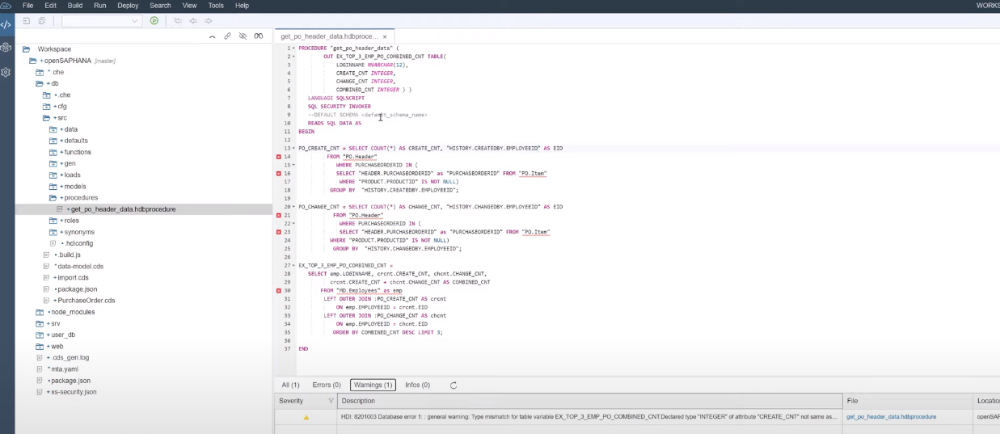

# SAP HANA Basics For Developers: SQLScript

## 7.1: Part 7.1 SQLScript Simple Procedure

In the WebIDE:
    go to DB
        go to src
            create a new folder (procedures)
            create a new procedure (get_po_header_data.hdbprocedure)
            `https://github.com/SAP-samples/hana-xsa-opensap-hana7/blob/snippets_2.3.2/ex2/ex2_17`
            
            There is a `Definer` and a `User` who has rights to run/access data. for read only, READ SQL DATA as and for non-read only it should be like `AS`

            Ignore client side error messages, focus on build status

            

            To check status, go to data explorer and from there stored procedures and then `get_po_header_data`
            then generate call statement, run it and you'll get data form table via stored procedures

## Part 7.2 SQLScript Scalar UDF (User Defined Function)

Has a Single output scalar parameter
Can be impebbed in a SQL statement rather than calling separate Statement like stored procedure

Go in db/src/functions/ create a new function (get_full_name.hdbfunction ) and paste `https://github.com/SAP-samples/hana-xsa-opensap-hana7/blob/snippets_2.3.2/ex2/get_full_name.sql`
change the stored procedure with this code:
`https://github.com/SAP-samples/hana-xsa-opensap-hana7/blob/snippets_2.3.2/ex2/get_po_header_data.sql` and build `db` again

Can check this in data explorer

## Part 7.3 SQLScript Table UDF

- Table function (single table output) - Scalar UDF (single scalar output)
- Looks like a view and can perform SELECT and other complex things
- Go to db/src/functions/ create a new function (`get_po_counts.hdbfunction`) and paste the following code `https://github.com/SAP-samples/hana-xsa-opensap-hana7/blob/snippets_2.3.2/ex2/get_po_counts2.sql` and build the db again and check from data explorer

## Part 7.4 SQLScript Libraries

Allows you to pull multiple stored procedures into a library with some shared variables and stuff
Go to db/src/libraries/ create a new database artifact `MasterData` and paste the code from `https://github.com/SAP-samples/hana-xsa-opensap-hana7/blob/snippets_2.3.2/ex2/MasterData.sql`
